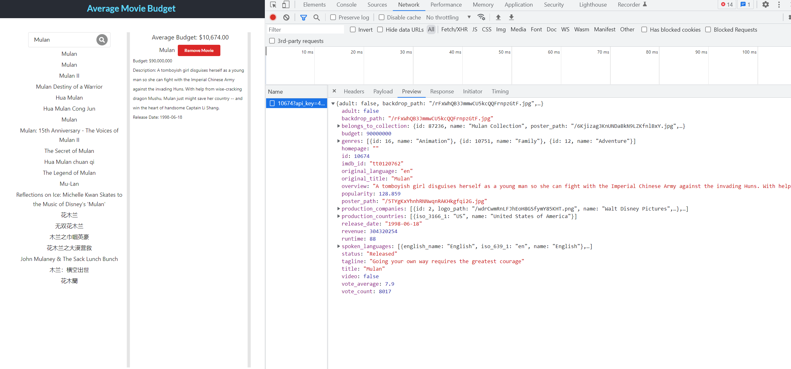

Hey

I created short simple test plan for this web application.
"Test plan.docx" attached
about TC ( test case ) if need I can create another document with steps and etc. 
and simple UI and API automation tests using Selenium and Rest Assured for API.

About the web application
all features (from the spec) work well except for the average budget calculator
I took a quick look at the code and it looks like the calculator is taking information from the {ID} field, not {Budget}
because when you add the first movie, the average budget shows the same number as the movie id.

need to fix calculator function
A lot of movies duplicates

If you have any questions please let me know

Sincerely
Edward 

